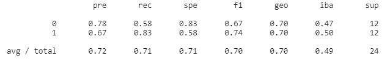
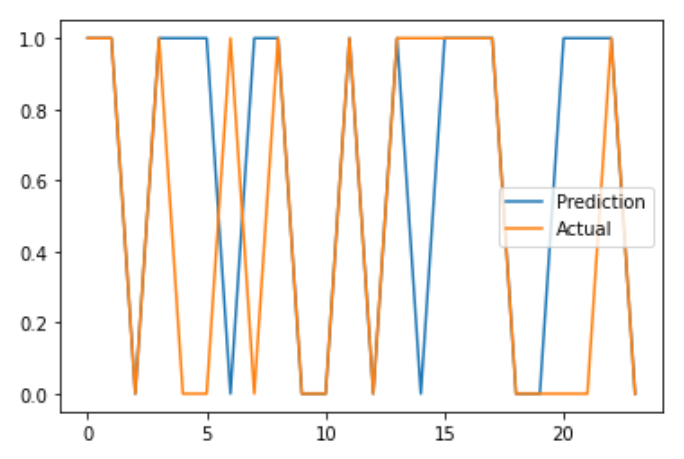

# FinTech_Project2_2021

Kedar, Alex, Nick

Project Name: Boom or Bust

Attachments:

> BOOMorBUST = python file
 
> monthly_modeling_df = our csv with final data used 

> Slideshow - Project2 - Team5 (Kedar, Alex, Nick) = our presentation slideshow in pdf form 
> 
> Images = a couple of image files that feed into out commentary lower in this README file

**NOTE TO PROJECT RESTRUCTURE**: When we initially set out to do our project, we wanted to use NLP data & sentiment to see if we could predict bankruptcies. We used the first two classes devising our approach, models, outlines, etc; however, once we started writing the code we ran into several major issues. The biggest issue was that while resources like newsapi and aylien did offer powerful news api's, having access to news lookback periods greater than several months cost large amounts of money or required corporate accounts (also expensive). Given we needed data going several years back (we were looking at 2020 bankruptcies and needed 2019 NLP data), we were in a conundrum. As such, we needed to restructure our project to fit within the constraints of our tools & time provided. The major constraint was the 1-month news/information lookback for newsapi.org. With this constraint we decided to update our project to use 1-month NLP data to predict if a stock price would go up or down over the course of a month. We then used the ML models learned in class to draw conclusions.

What are we trying to do (update)?

> Use one month of NLP data to predict if a stock price will go up or down (binary outcome)
 
 
How (update)?

> Using 1-month NLP data from newsapi.org & other relevent stock factors from our Fidelity.com screener/excel export
> We will use the above data set to scale, train, and test models (classification models)
> We will evaluate a number of different ML models to determine the best fit
 
 
Data (update): 

> 1) Company name & ticker

> 2) Column or columns containing positive/negative/neutral/compound NLP sentiment

> 3) Column with binary classification "1" for stocks that went up, and "0" for stocks that went down

 
Training & Testing Our Model (update):

> We will try a variety of ML models, focused around classifaction models & models that evaluate binary outcomes (did the stock go up or down, and how are these movements correlated to NLP data & sentiment)
 
 
Stretch:

> We will include more identifying factors in our dataset (financial ratios, technical indicators, sectors, macro economic data), to make our model stronger

Resoureces:

> Fidelity.com

> Newsapi.org

Likely Libraries & APIs:

> newsapi

> sklearn

> tensorflow

> nltk.sentiment.vader
 
> Imblearn

Tasks:

> Search for best stock data (Kedar)

> Build NLP function & python (Nick)

> Slides (Alex) 

Conclusion:

> Please reference our slide show pd for a more complete overview
 
> To evaluate our data (which was hard to come by), we most seriously considered the Linear Regression, Easy Ensemble Classifier, & SMOTE Oversampling models. We also ran a Neural Network model for fun, and tried a Naive Bayes model as our "new" model. We took the Linear Regression, Easy Ensemble Classifier, & SMOTE Oversampling models most seriously because we knew that classifier models were the best fit here. We started with Linear Regression, because we believed that was the most basic form of classifier and a good place to start. We chose an Easy Ensemble Classifier because we were afraid the limited data set and unpredicatble sentiment information might make for a "weak learner". And finally, we chose the SMOTE Oversampling model because we did not have an equal number of "1"'s and "0"'s. You can review all of the outcomes in our python & slideshow files, but for our conclusion the Linear Regression model performed the best with a balance accuracy of ~71%. The Linear Regression model accurately predicted outcomes for 16 of the 23 companies in the training results. This gave us hope that further tuning & data collection may actually yield a workable solution, but we would need bettwer access to data and more time. 

Visualizations:

> Given we used classifier models for binary outcomes, there were not terrific opportunities for visualization (we only had visualizations for the linear regression model because it was our most successful model & for the neural network model because visualization is more appropriate for that model). Below are the results & the visualization for the Linear Regression model. To understand the model, we graphed the "Prediction" vs "Outcome" DataFrame (or "Result" DataFrame in the python file). The model guessed 16 of 23 price movements correclty. Where you only see "Orangee" means an accuracte prediction, if you see "Blue" there was an inaccurate prediction.

